<div align="center">

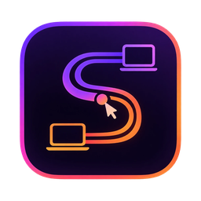

# Synkflow

### Your desk. In sync.

One mouse and keyboard across your own computers, with a shared clipboard and file sending.<br>
Open source · 100 % local · no account · no cloud · no relay · no telemetry.

<p>
  <a href="LICENSE"></a>
  
  
  
  
  
  
</p>

<p>
  <a href="#see-it-in-action"><b>See it in action</b></a> ·
  <a href="#download"><b>Download</b></a> ·
  <a href="#quick-start">Quick start</a> ·
  <a href="#how-it-works">How it works</a> ·
  <a href="#security-in-one-paragraph">Security</a> ·
  <a href="#documentation">Docs</a>
</p>

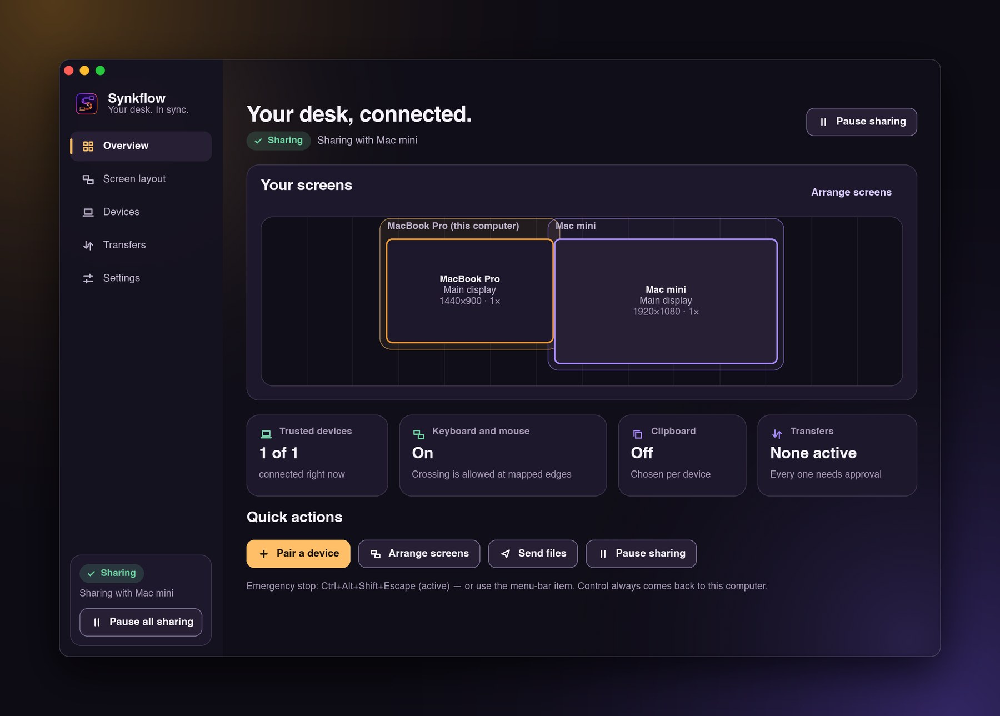

</div>

<br>

Synkflow is a **software KVM**. Push the pointer past the edge of one computer's screen and it carries on at the next computer, with
the keyboard following. Copy on one, paste on the other. Drop a file on the window to send it. It all happens on **your own network**,
between computers **you** approved by comparing their fingerprints. Nothing goes to the internet, ever.

It is written in **Rust** (Tokio, rustls / TLS 1.3, mDNS) with a native **Slint** interface: no browser, no Electron, no web server.

## See it in action

<table>
<tr>
<td width="300" valign="top">
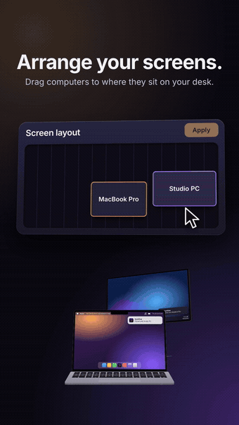
</td>
<td valign="top">

**The 40-second film** (the clip on the left is a taste of it)

⬇ [`synkflow-showcase.mp4`](https://github.com/KleivinX/SynkFlow/raw/main/docs/media/synkflow-showcase.mp4) · 1080×1920 · 12 MB<br>
⬇ [`synkflow-teaser.mp4`](https://github.com/KleivinX/SynkFlow/raw/main/docs/media/synkflow-teaser.mp4) · the 23-second teaser · 7 MB

Pair once. Arrange your screens by dragging. Push past the edge. Copy here, paste there. Send a file. Hit emergency stop.

<sub>The film is a concept animation with simulated Mac and Windows screens, not a screen recording. The real interface is shown below.</sub>

</td>
</tr>
</table>

<p align="center">
  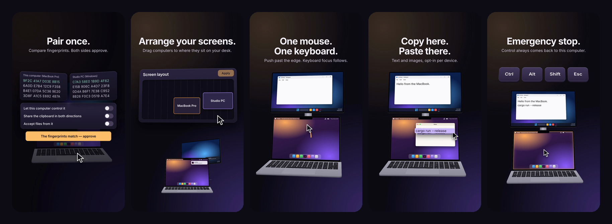
</p>

## The interface

<table>
<tr>
<td width="50%">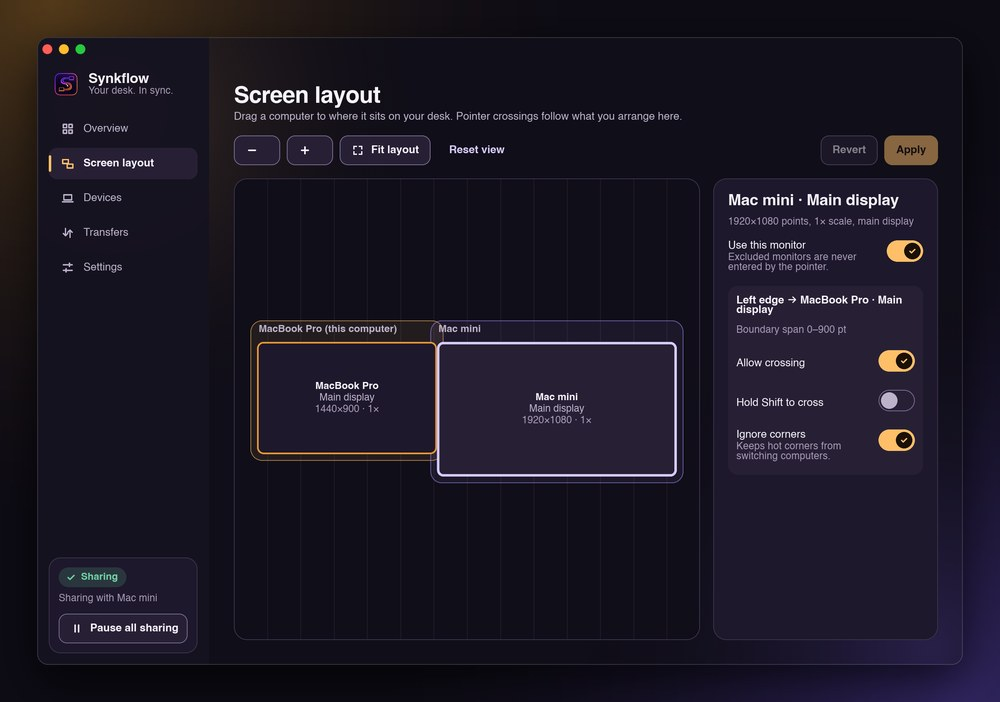<br><sub><b>Arrange by dragging.</b> Computers, with all their monitors, snap into place.</sub></td>
<td width="50%">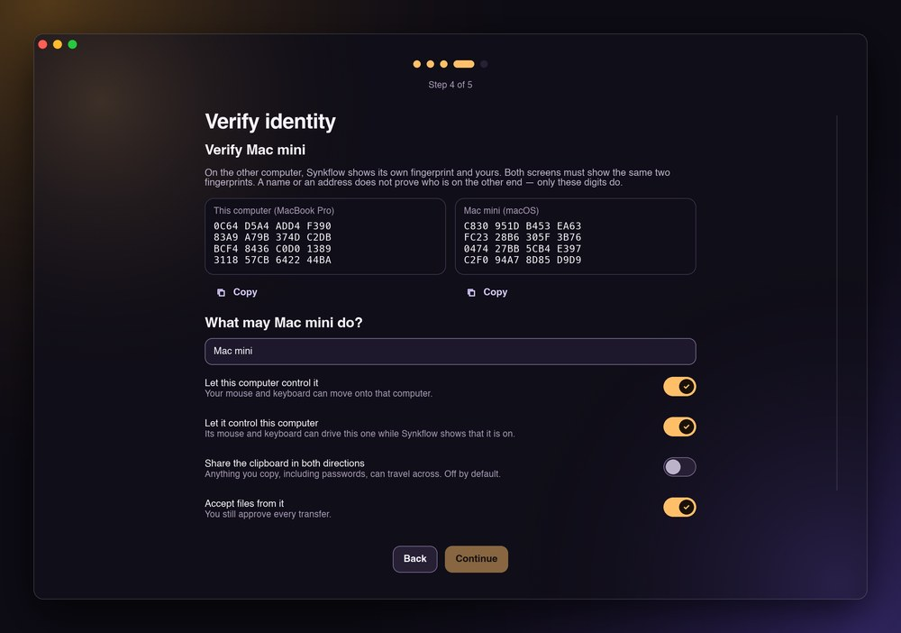<br><sub><b>Pair by comparing fingerprints.</b> Nothing is trusted until both people approve.</sub></td>
</tr>
<tr>
<td width="50%">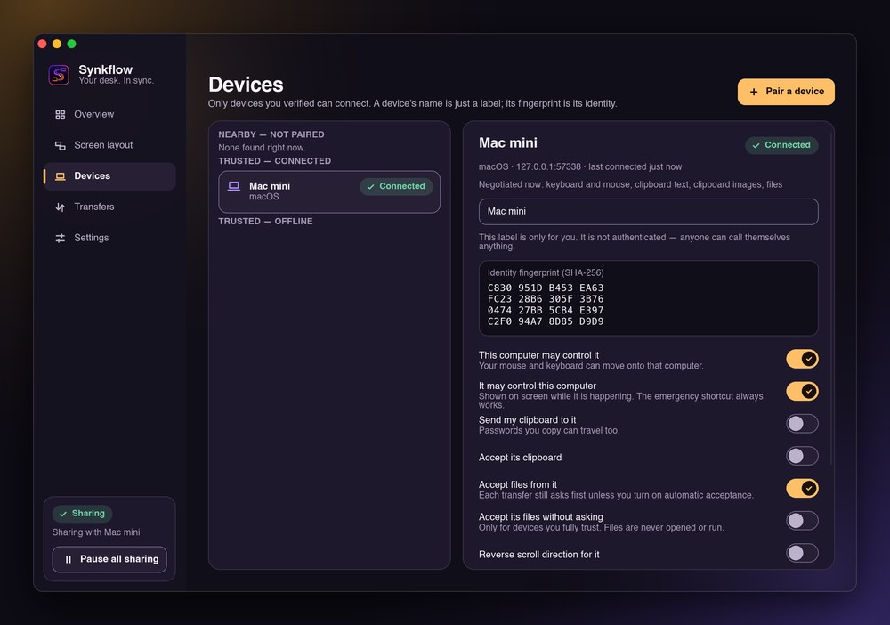<br><sub><b>Per-device permissions</b> for input, clipboard and files.</sub></td>
<td width="50%">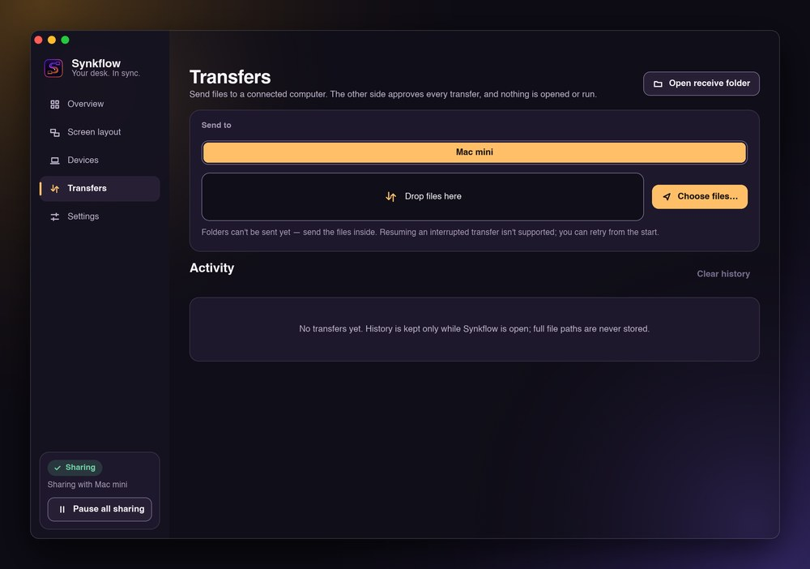<br><sub><b>Files the other side approves,</b> verified with SHA-256.</sub></td>
</tr>
<tr>
<td width="50%">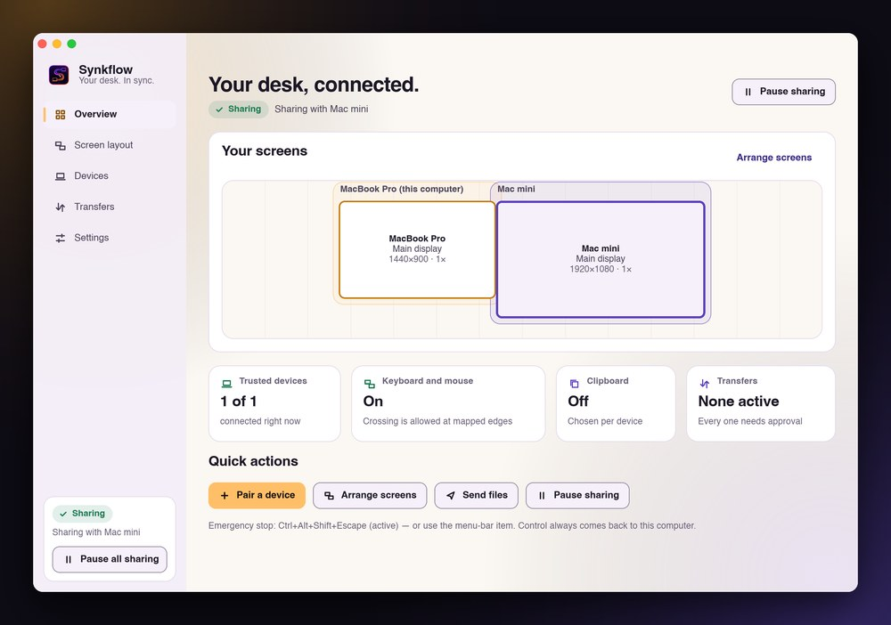<br><sub><b>Light and dark,</b> plus reduced motion, reduced transparency and large text.</sub></td>
<td width="50%">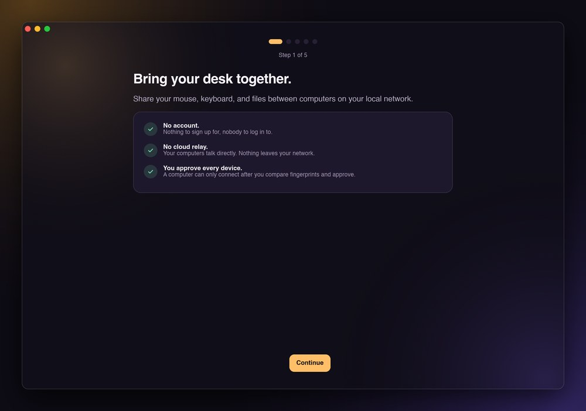<br><sub><b>Five-screen onboarding</b> that says what it does and what it never does.</sub></td>
</tr>
</table>

<sub>These screenshots are rendered by the real interface from real engine state (two engines paired over loopback TLS); only the operating-system keyboard and mouse layer is a stand-in. Regenerate them with `examples/ui_snapshots.rs`.</sub>

## What it does

| | |
|---|---|
| **Cross the edge** | Push the pointer past the edge of one computer's screen and it continues on the next. Keyboard focus follows. |
| **Arrange by dragging** | Drag computers (each with all its monitors) to where they sit on your desk. Snapping, validity checks, per-edge rules. |
| **Mac ↔ PC shortcuts** | ⌘C on a Mac keyboard is Ctrl+C on the Windows computer, and the other way round. Only between a Mac and a PC. |
| **Clipboard** | Text and images, opt-in per device, never stored or logged, loop-proof, skips items password managers mark private. |
| **Send files** | Choose files or drop them on the window. The other side approves; SHA-256-verified; never overwrites; never opens anything. |
| **Discovery** | mDNS on your LAN, or type an address. Discovery only introduces a device; **you** approve it by comparing fingerprints. |
| **Emergency stop** | `Ctrl+Alt+Shift+Esc` (configurable) and a menu-bar item return control and release every held key. |

## Download

> **Early preview (v0.1).** The installers are **unsigned**, so macOS Gatekeeper and Windows SmartScreen will warn the first time.
> That is expected for a project without paid signing certificates. Read [the status](#status-what-is-and-is-not-verified) first.

Installers are attached to the [**v0.1.0 release**](https://github.com/KleivinX/SynkFlow/releases).

| Platform | File | Notes |
|---|---|---|
| **macOS 11+** | `Synkflow-0.1.0.dmg` | Intel (x86_64) build. Open it, drag Synkflow to Applications, then right-click → Open the first time. Grant Accessibility and Input Monitoring when asked. |
| **Windows 10 / 11** (64-bit) | `Synkflow-Setup-0.1.0.exe` | Per-user install, no administrator rights. When Windows Firewall asks, allow Synkflow on **private** networks. |
| **Linux (X11)** | build from source | Needs an X11 session. Wayland cannot capture or inject input and is reported as unsupported. |

A plain-text walkthrough with troubleshooting is in [`docs/TUTORIAL.txt`](docs/TUTORIAL.txt).

## Quick start

1. Install Synkflow on both computers and open it. A five-screen onboarding walks you through permissions.
2. On one computer open **Pair a device**. The other computer appears under *Nearby computers* (or type its address).
3. Both screens show **the same two fingerprints**. Check they match, then approve on **both** computers.
4. Drag the computers into the order they sit on your desk, then **Apply**.
5. Push the pointer past the shared edge. You are now using one mouse and keyboard.

<details>
<summary><b>Run or build from source</b></summary>

```bash
cargo run --release                   # the desktop app
cargo run --release -- --selftest     # headless engine check, prints capabilities
cargo test --no-default-features      # all tests without compiling the UI
cargo fmt --check && cargo clippy --all-targets
```

Packaging (macOS `.app`/`.dmg`, Windows installer, Linux desktop entry), signing and notarization notes, and **offline / vendored builds** are in
[`docs/BUILDING.md`](docs/BUILDING.md). Environment variables for testing, such as two instances on one computer:
`SYNKFLOW_CONFIG_DIR=<dir>`, `SYNKFLOW_SECRET_STORE=file`, `SYNKFLOW_LOG=debug`, `SYNKFLOW_DEVICE_NAME=<name>`.

</details>

## How it works

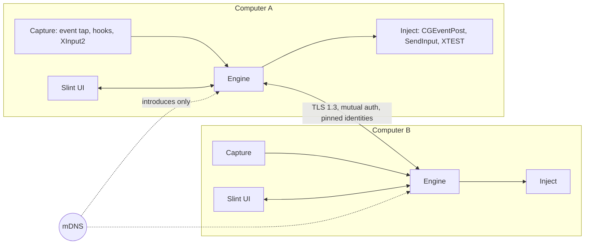

- **One engine per computer.** A single actor owns all state; a pure state machine (events in, effects out) decides who controls whom, so
  the logic is testable without a keyboard, a mouse or a network.
- **Two engines in the tests.** The automated tests pair two complete engines over loopback TLS, including a hand-driven hostile peer.
- **Operating-system layers are small and separate.** Capture and injection sit behind one trait with macOS, Windows and X11 implementations.

Deeper reading: [Architecture & protocol](docs/ARCHITECTURE.md) · [Design system](docs/DESIGN.md).

## Security in one paragraph

Every byte between your computers (input, clipboard, files, control messages) travels over **TLS 1.3 with mutual authentication and pinned
device identities**; there is no plaintext fallback and no "accept any certificate" path to a session. A device becomes trusted only after both
people compare the **full SHA-256 fingerprints** and both approve. Revoking a device ends its sessions immediately. Transport encryption does
**not** protect against malware already running on a participating computer. See [`SECURITY.md`](SECURITY.md) and
[`docs/THREAT_MODEL.md`](docs/THREAT_MODEL.md).

## Status: what is and is not verified

This project says plainly what has been checked. The full list is in [`docs/LEDGER.md`](docs/LEDGER.md) and [`docs/CAPABILITIES.md`](docs/CAPABILITIES.md).

| | |
|---|---|
| ✅ **Automated tests (171)** | Protocol, pairing, trust, the control state machine, clipboard rules, file transfer and layout logic, with two complete engines over loopback TLS. |
| ✅ **macOS app** | Builds, passes its self-test, launches, packages into an ad-hoc-signed `.dmg`. |
| ⚠️ **Real input capture and injection** | Not exercised by the automated tests on any operating system. Use the manual checklist in [`docs/TESTING.md`](docs/TESTING.md). |
| ⚠️ **Windows** | Cross-built from macOS and checked structurally. Real-hardware testing is only starting; expect rough edges and please report them. |
| ◻️ **Linux X11** | Written but not yet built or run by the author. |
| ❌ **Linux Wayland** | Cannot capture or inject input. Clipboard and files only, and the app says so. |

## Roadmap

- Native Apple Silicon build, and code signing / notarization for macOS and Windows
- Verification on real Windows and Linux hardware, and continuous integration on all three systems
- QR-assisted fingerprint verification
- Wayland support through portals and libei
- Folder transfers and transfer resume, fuzz targets for the protocol decoder

## Documentation

[Architecture & protocol](docs/ARCHITECTURE.md) · [Threat model](docs/THREAT_MODEL.md) · [Capability matrix](docs/CAPABILITIES.md) ·
[Permissions](docs/PERMISSIONS.md) · [Building](docs/BUILDING.md) · [Testing & manual checklist](docs/TESTING.md) ·
[Benchmarks](docs/BENCHMARKS.md) · [Design system](docs/DESIGN.md) · [Implementation ledger](docs/LEDGER.md) ·
[Changelog](CHANGELOG.md) · [Contributing](CONTRIBUTING.md)

## Contributing

Bug reports, ideas and pull requests are welcome. If two computers will not connect, open an issue and paste **Settings → Diagnostics → Copy diagnostics**
from both of them. Read [`CONTRIBUTING.md`](CONTRIBUTING.md) first; security reports go through [`SECURITY.md`](SECURITY.md).

If Synkflow is useful to you, a ⭐ on the repository helps other people find it.

## Made by

**Kleivin Gjuzi** builds open-source tools for fun and uses every one of them in daily life. Say hello or follow along:

<p>
  <a href="https://www.linkedin.com/in/kleivin-gjuzi-7a7w/"></a>
  <a href="https://www.instagram.com/kleivingjuzi/"></a>
</p>
<p>
  <a href="https://www.instagram.com/blocksandbrew/"></a>
  <a href="https://www.tiktok.com/@blocksandbrew"></a>
  <a href="https://blocksandbrew.com"></a>
</p>

## License

[GPL-3.0-only](LICENSE). Third-party notices are in [`THIRD_PARTY_NOTICES.md`](THIRD_PARTY_NOTICES.md).
Synkflow is an independent implementation. It is inspired by the publicly described behaviour of similar tools, shares no code, branding or
assets with them, and is not affiliated with any of them. The application identifier is the provisional `example.synkflow.Synkflow`
(the `.example` top-level domain is reserved and cannot be registered); replace it when the project owns a real one.
